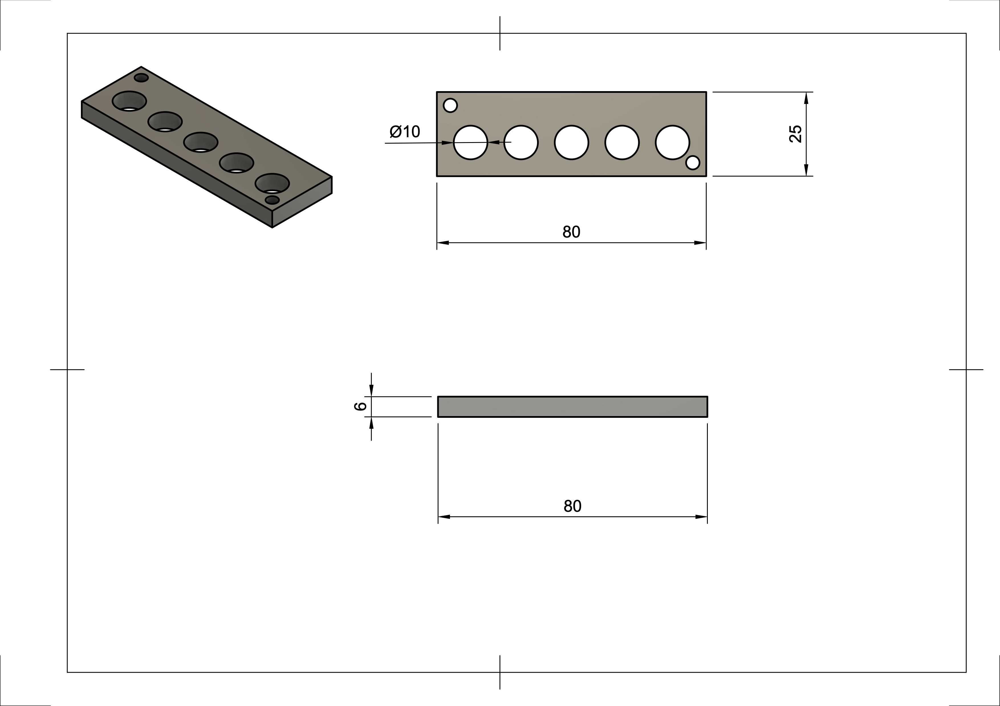

```{r setup, include=FALSE}
knitr::opts_chunk$set(echo = FALSE)

# import libraries
library(tidyverse) # tidy
library(janitor) # for cleaning names
library(readxl) # package for importing data
library(ggplot2)
library(gt)
```

## Permeability Analysis


```{r}
knitr::opts_chunk$set(echo = FALSE)

# load data

file_path <- "~/Google\ Drive/for_Billy_Koech/from_Billy/Fe+Elastomer\ experiments/V2_experiment_design_mixing_ratios_by_volume.xlsx"

ferroelastomer_data <- read_xlsx(file_path,
                                 sheet = 2,
                                 range = cell_rows(1:53)) %>%
                                 clean_names()


# gather the data
gathered_data <-ferroelastomer_data %>%
                gather(c(x1_inductance_u_h_at_1khz,
                         x2_inductance_u_h_at_1khz,
                         x3_inductance_u_h_at_1khz,
                         x4_inductance_u_h_at_1khz,
                         x5_inductance_u_h_at_1khz), 
                       key = "quantity",
                       value = "uH",
                       na.rm = FALSE)


# group by sample number and compute mean and standard deviation
avg_and_std <- gathered_data %>%
                    group_by(sample_number, 
                             volume_ratio,
                             particle_size_microns,
                             mass_ratio, ecoflex,
                             vacuumed,
                             repeated,
                             a_volume_cm3,
                             b_volume_cm3,
                             particles_volume_cm3
                             ) %>%
                    summarise(avg = mean(uH), dev = sd(uH)) %>%
  na.omit()
```


```{r}

knitr::opts_chunk$set(echo = FALSE)

# function to plot graph params:
# plot_by: name of column to use for x axis => volume_ratio or mass_ratio
# ecoflex_n : type of ecoflex
# vacuumed_bool: whether to plot vacuumed or non_vacuumed
# repeat_param: change to 1 to plot fialed values only
# apply_func: fuction to change values in y axis
# graph_name : goes on title and y axis label

plot_graph <- function(plot_by,
                       ecoflex_n,
                       vacuumed_bool,
                       repeat_param,
                       apply_func,
                       graph_name){
  
  avg_and_std %>%
    filter(ecoflex == ecoflex_n,
           vacuumed == vacuumed_bool,
           repeated == repeat_param) %>% 
    ggplot(aes(x = eval(parse(text = plot_by)),
               y = apply_func(avg),
               group = particle_size_microns,
               color = as.factor(particle_size_microns))) +
    geom_line() +
    geom_point() +
    labs(title = paste("Graph of",
                       graph_name,
                       "for Ecoflex ",
                       ecoflex_n),
         subtitle  = "Each line represents particles of different sizes",
         color = "Iron particle sizes") + 
    xlab(label = paste("Percentage of Iron in sample by ", plot_by)) + 
    ylab(label = graph_name) +
    geom_errorbar(aes(ymin= apply_func(avg-dev),
                      ymax= apply_func(avg+dev)),
                  width=.01) +
    geom_hline(yintercept = apply_func(412.7), color = "red") +
    geom_hline(yintercept = apply_func(1076.2), color = "blue") +
    geom_label(mapping=aes(x=0,
                          y=apply_func(1076.2),
                          label = "iron powder"),
              vjust=1.2,
              hjust=-3,
              colour ="blue") + 
    geom_label(mapping=aes(x=0,
                          y=apply_func(412.7),
                          label = "air core"),
              vjust=-0.5,
              hjust=-5,
              colour ="red")
  
}

# faceted plot
# same as plot_graph but makes facets instead
plot_graph_faceted <- function(plot_by,
                               ecoflex_n,
                               vacuumed_bool,
                               repeat_param=0,
                               apply_func,
                               graph_name){
  
  avg_and_std %>%
    filter(ecoflex == ecoflex_n,
           vacuumed == vacuumed_bool,
           repeated == repeat_param) %>% 
    ggplot(aes(x = eval(parse(text = plot_by)),
               y = apply_func(avg),
               )) +
    facet_wrap(~particle_size_microns) +
    geom_line() +
    geom_point() +
    labs(title = paste("Graph of",
                       graph_name,
                       "for Ecoflex ",
                       ecoflex_n),
         subtitle  = "Each box represents particles of different sizes",
         color = "Iron particle sizes") + 
    xlab(label = paste("Percentage of Iron in sample by ", plot_by)) + 
    ylab(label = graph_name) +
    geom_errorbar(aes(ymin= apply_func(avg-dev),
                      ymax= apply_func(avg+dev)),
                  width=.01) +
    geom_hline(yintercept = apply_func(412.7), color = "red") +
    geom_hline(yintercept = apply_func(1076.2), color = "blue") + 
    geom_label(mapping=aes(x=0,
                          y=apply_func(1076.2),
                          label = "iron powder"),
              vjust=1.2,
              hjust=-3,
              colour ="blue") + 
    geom_label(mapping=aes(x=0,
                          y=apply_func(412.7),
                          label = "air core"),
              vjust=-0.5,
              hjust=-5,
              colour ="red")
  
}

# function to convert inductacne to relative permeability

L_to_miu_r <- function(L){
  l <- 6.23 * 10^(-3)       # lenght of coil in meters
  u_o <- 1.26 * 10^(-6)     # permeability of free space in T-m/At
  N <- 100                  # number of turns
  A <- pi * (5 * 10^(-3))^2 # cross sectional area of coil, radius = 5mm
    
  # calculate relative permeability
  return((L * (10^(-6)) * l) / (u_o * (N^2) * A))
}

# function that does not alter input

no_function <- function(input){
  return(input)
}


# function to create multiple plots
plot_all <- function(plot_by, ecoflex_n){
  

p1 <- plot_graph(plot_by = plot_by , ecoflex_n = ecoflex_n, vacuumed_bool = 0, repeat_param = 0, apply_func = no_function, graph_name = "Inductance at 1KHz in uH")

# Faceted graph of volume ratio againt inductance 
# p2 <- plot_graph_faceted(plot_by = plot_by, ecoflex_n = ecoflex_n, vacuumed_bool = 0, repeat_param = 0, apply_func = no_function, graph_name = "Inductance at 1KHz in uH")

# graph of volume ratio against relative permeability
p3 <- plot_graph(plot_by = plot_by , ecoflex_n = ecoflex_n, vacuumed_bool = 0, repeat_param = 0, apply_func = L_to_miu_r, graph_name = "Relative permeability")

# Faceted graph of volume ratio against relative permeability
# p4 <-plot_graph_faceted(plot_by = plot_by, ecoflex_n = ecoflex_n, vacuumed_bool = 0, repeat_param = 0, apply_func = L_to_miu_r, graph_name = "Relative permeability")

list(p1,p3)

}

# faceted plot for vacuumed samples
vacuum_comparison_graph <- function(plot_by, ecoflex_n, repeat_param=0, apply_func, graph_name){
  
  avg_and_std %>%
    filter(ecoflex == ecoflex_n,
           repeated == repeat_param,
           vacuumed != 2) %>% 
    ggplot(aes(x = eval(parse(text = plot_by)),
               y = apply_func(avg),
               group = vacuumed,
               color = as.factor(vacuumed))) +
    facet_wrap(~particle_size_microns) +
    geom_line() +
    geom_point() +
    labs(title = paste("Graph of", graph_name, "against", plot_by, "for Ecoflex ", ecoflex_n),
         subtitle  = "Each box represents particles of different sizes",
         color = "Vacuum state") + 
    xlab(label = paste("Percentage of Iron in sample by ", plot_by)) + 
    ylab(label = graph_name) +
    geom_errorbar(aes(ymin= apply_func(avg-dev), ymax= apply_func(avg+dev)), width=.01) +
    geom_hline(yintercept = apply_func(412.7), color = "red") +
    geom_hline(yintercept = apply_func(1076.2), color = "blue") + 
      geom_label(mapping=aes(x=0,
                          y=apply_func(1076.2),
                          label = "iron powder"),
              vjust=1.2,
              hjust=-3,
              colour ="blue") + 
    geom_label(mapping=aes(x=0,
                          y=apply_func(412.7),
                          label = "air core"),
              vjust=-0.5,
              hjust=-5,
              colour ="red")
}


vacuum_comparison_single_size <- function(plot_by,
                       ecoflex_n,
                       vacuumed_bool,
                       repeat_param,
                       apply_func,
                       graph_name,
                       size_p){
  
  avg_and_std %>%
    filter(ecoflex == ecoflex_n,
           repeated == repeat_param,
           particle_size_microns == size_p,
           vacuumed != 2) %>% 
    ggplot(aes(x = eval(parse(text = plot_by)),
               y = apply_func(avg),
               group = vacuumed,
               color = as.factor(vacuumed))) +
    geom_line() +
    geom_point() +
    labs(title = paste("Graph of",
                       graph_name,
                       "against",
                       plot_by,
                       "for Ecoflex ",
                       ecoflex_n),
         subtitle  = paste("Plot for vaccumed and non-vacuumed for", size_p, "micron particles"),
         color = "Vacuum state") + 
    xlab(label = paste("Percentage of Iron in sample by ", plot_by)) + 
    ylab(label = graph_name) +
    geom_errorbar(aes(ymin= apply_func(avg-dev),
                      ymax= apply_func(avg+dev)),
                  width=.01) +
    geom_hline(yintercept = apply_func(412.7), color = "red") +
    geom_hline(yintercept = apply_func(1076.2), color = "blue") + 
    geom_label(mapping=aes(x=0,
                          y=apply_func(1076.2),
                          label = "iron powder"),
              vjust=1.2,
              hjust=-3,
              colour ="blue") + 
    geom_label(mapping=aes(x=0,
                          y=apply_func(412.7),
                          label = "air core"),
              vjust=-0.5,
              hjust=-5,
              colour ="red")
  
}


# VOLUME PLOTS ECOFLEX 30
plot_all("volume_ratio", 30)


# MASS PLOTS ECOFLEX 30
plot_all("mass_ratio", 30)


# VOLUME PLOTS ECOFLEX 30
plot_all("volume_ratio", 20)


# plot vacuumed samples and non vacuumed for particles size = 300
vacuum_comparison_single_size(plot_by = "volume_ratio", ecoflex_n = 30, repeat_param = 0, apply_func = L_to_miu_r, graph_name = "Relative permeability", size_p = 300)

# plot vacuumed samples and non samples for all particle sizes
vacuum_comparison_graph(plot_by = "volume_ratio", ecoflex_n = 30, repeat_param=0, apply_func = L_to_miu_r, graph_name = "Relative permeability")

```


## Summary of results

## Methodology
### Overview

The samples are fabricated by mixing ecoflex with particles of different sizes at different mass and volume ratios. Below are the particle sizes used in increasing size:

* -20 Mesh Iron (100 microns)
* -70 Mesh Iron (210 microns)
* Iron 12 (300 microns)
* 6-10 microns
* 1-4 microns

Types of ecoflex used:
* Ecoflex 30
* Ecoflex 20
* Ecoflex 10

This report includes a summary for just _*Ecoflex 30*_.

### Fabrication procedure

The experiments were designed by volume ratio where the ecoflex and particles were mixed by measuring their volumes until ratios (specified below) were achieved.
For the first samples(samples #1 to #6) the samples were mixed in the volume ratios shown in Table 1. The mixtures yielded the mass ratios shown on the table.

```{r echo=FALSE}
tibble(sample_number = avg_and_std$sample_number[1:6], particles_size = avg_and_std$particle_size_microns[1:6], ecolfex = avg_and_std$ecoflex[1:6], volume_ratio = avg_and_std$volume_ratio[1:6], mass_ratio = avg_and_std$mass_ratio[1:6], ) %>% gt() %>% tab_header(
    title = "Table 1: Experiment design for first 6 samples"
  ) 

```

The rest of the the samples were mixed in the following volume ratios:

```{r}
tibble(Volume_ratios = avg_and_std$volume_ratio[7:12],
       Ecoflex_part_A_volume =avg_and_std$a_volume_cm3[7:12],
       Ecoflex_part_B_volume = avg_and_std$b_volume_cm3[7:12],
       Particles_volume = avg_and_std$particles_volume_cm3[7:12]) %>% gt() %>% tab_header(
    title = "Table 2: Volume ratios used in the rest of the samples",
    subtitle = "All volumes are in cubic centimeters"
  ) 
```

The mixing procedure starts with placing a 50 gram-sized cup on mass measuring scale and zeroing the scale. The volume of part A ecoflex is then measuring using a volumetric syringe and then poured into the 50 gram-sized cup. The volume of particles is then measuring also using a similar syringe and poured into the same cup. Finally, the volume of part B ecoflex is then measuring and poured into the cup. Mass measuremements are read off the measuring scale and recorded after each addition of components into the cup. The table therefore consists of both volume measurements and mass measurements.

The mixture is then mixed by hand using a popsickle stick for about 10 seconds. The cup is then inserted into a "THINKY" centrifugal mixer and mixed at 2000 revolutions per minute(rpm) for 30 seconds. After completion, the mixture is poured into 3D printed moulds shown in figure 1 below and inserted into a oven at 60 degrees celcius. The mold is designed to allow for 5 samples for each mixing ratio. The The curing times for all the samples are shown in Table 3.

After the samples have had sufficient time to cure, they are taken out of the oven photographed and their inductances measured.

### Inductance and permeability measurements

The 3D printed molds are designed in such a way that the resulting sample is able to fit into a cylindrical coil of N turns and l length. This allows for the measurement of the inductance of the core using an RLC meter. Table 3 shows the avereage, median, and standard deviation of the inductances of the 5 samples for each mixing ratio. Table 

The relative permeability is calculated from the inducance using the inductance formula of a coil with a core. See equation 1 below.


<p align="center">
{width=65%}
</p>


The table belows shows the particles sizes, ecoflex type, curing times, meanmedia


    * table of particles, ecoflex, curing time, mean, median, standard deviation,
### Measurement method for inductance  
measurement methods for the inductance
  * Graphs 
    * Graphs with volume ratio and inductance/ permeabiltiy (two scales on the y axis)
    * Graphs with volume ratio and inductance / permeabiltiy (two scales on the y axis)
    * formula for L as a function of permeability:
      * inducance for a cylinder
      * inductance with a core
    * then graphs of volume ration and permeability
    * graphs of mass ratio and permeability 
    
    
    
* Also talk about why the mass ratio graph appears how it does and what that means for the apperance of the volume ratio graph
* 